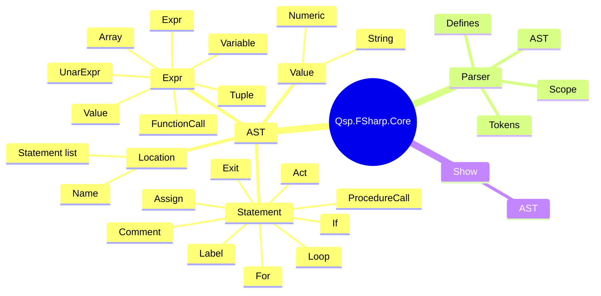

# Qsp.FSharp.Core

## Map

```mermaid
mindmap
  root((Qsp.FSharp.Core))
    AST
      Location
        Name
        Statement list
      Statement
        Assign
        ProcedureCall
        If
        Act
        For
        Loop
        Label
        Comment
        Exit
      Expr
        Value
        Variable
        FunctionCall
        Array
        UnarExpr
        Expr
        Tuple
      Value
        Numeric
        String
    Parser
      Tokens
      Scope
      Defines
      AST
    Show
      AST
```
